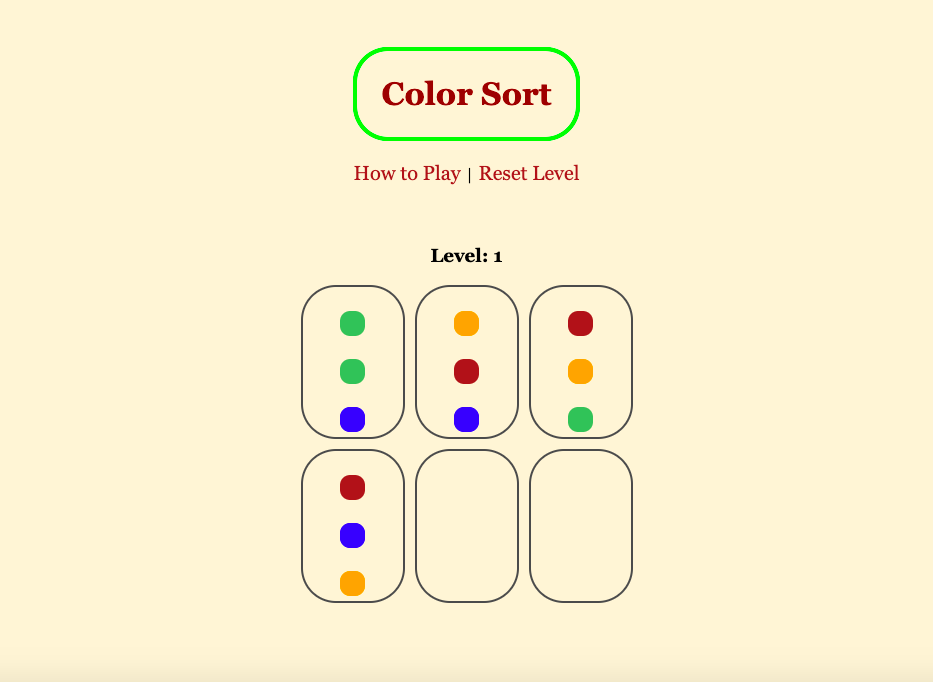

# Color Sort
___________________________

###### Live Link: [Play Here](https://bbkc27.github.io/color-sort-game/index.html)

___________________________
### Objective

Color sort is a logic puzzle. The game starts with different colored balls stacked in tubes in groups of 3. there are 2 empty tubes given. The objective of the puzzle is to sort all the balls into tubes by color. Only the top ball in each tube can be moved. Balls can only be dropped into empty tubes or on top of balls of the same color.    

**Solution**

Players start at level 1. There are 3 levels total that increase in difficulty. The objective for each level is the same. There's no limit on the number of moves a player can make. 

**Screenshots**

____________

### Playing the Game

To start, the player can drag any of the top balls from their current tube to an empty tube. From there, players can move balls to tubes if there are less than 3 balls already in it and the dragged ball is the same color as the ball at the top of the stack. Players will be notified with a pop-up box letting them know they've won the level and can go to the next one  *or* that the game is over. 

While playing, players have the option, at any time, to reset the current level they're on *or* reset the whole game.
___________________________

### Wireframes
- [Starting Screen](https://media.git.generalassemb.ly/user/41193/files/59d08180-9b18-11ec-9951-542a66b84aad)
- [Winning Screen](https://media.git.generalassemb.ly/user/41193/files/60f78f80-9b18-11ec-9244-10bba8fa6524)

________________________________

### Major Hurdles

- Adding drag/drop feature for each ball
- Allowing only the top ball in each tube draggable
- Allowing balls to only be dropped in empty tubes or tubes with an empty space
- Not letting balls be dropped on other ball divs  - aka not letting ball divs become parent elements (avoiding overlap)
- Allowing balls to only drop in a non-empty tube if they were stacking on top of a ball that was the same color (this was the hardest hurdle!)
- Creating a functional win condition 
______________________________________